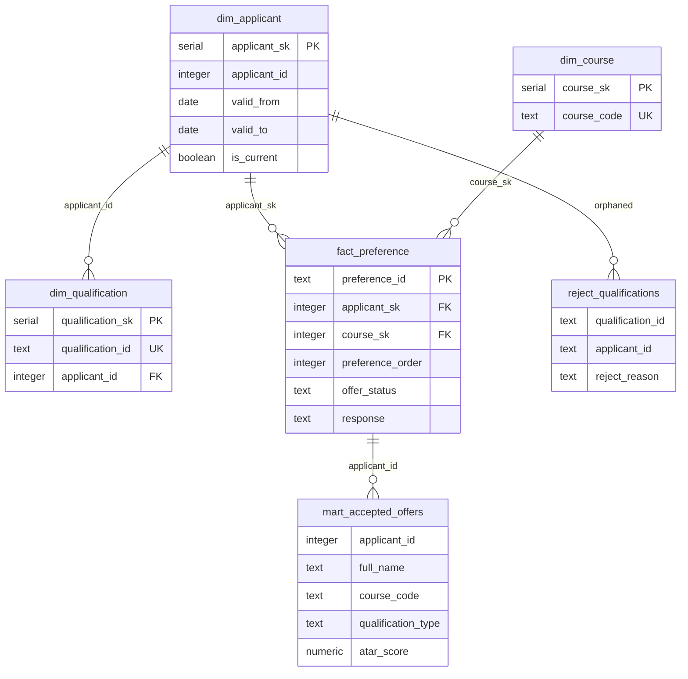

# QTAC Admissions Data Warehouse

Postgres warehouse pipeline over QTAC admissions extracts. Raw landing →
Kimball star schema with SCD2 on the applicant dimension → mart summarising
accepted offers per applicant.

---

## Approach

Kimball dimensional model with SCD Type 2 on the applicant dimension.

The data has one slowly changing entity (applicants update address, name, etc.
over time) and a natural star schema shape — preferences as fact, with
applicants, courses, and qualifications as dimensions. Data Vault adds
hub/link/satellite overhead without meaningful benefit at this source count
or volume.

Three-layer pipeline:

- **Raw** — faithful copy of source CSVs. All columns land as TEXT with
  `load_ts` and `source_file` audit columns. No transformation at landing.
- **Warehouse** — typed, cleaned dimensions and facts. SCD2 handles applicant
  versioning. Orphaned qualifications are quarantined rather than silently
  dropped.
- **Mart** — `accepted_offers` rebuilt in full on each run. One row per
  applicant showing their accepted course and primary qualification.

---

## Data model



---

## Stack

- Postgres 16 (Docker)
- SQL transforms orchestrated by bash scripts

---

## Setup

```bash
sudo apt install -y postgresql-client    # WSL / Ubuntu
docker compose up -d
```

Postgres on `localhost:5432` — user `qtac`, password `qtac`, database `qtac`.

---

## Load sequence

```
applicants.csv        ──► raw.applicants     ──► dim_applicant (SCD2) ──┐
applicants_update.csv ──► raw.applicants                                 │
courses.csv           ──► raw.courses        ──► dim_course              ├──► mart.accepted_offers
qualifications.csv    ──► raw.qualifications ──► dim_qualification  ─────┤
                                              └► reject_qualifications   │
preferences.csv       ──► raw.preferences   ──► fact_preference   ───────┘
```

```bash
bash scripts/01_initial_load.sh    # schema DDL, raw load, warehouse + mart
bash scripts/02_update_load.sh     # append update extract, re-run warehouse + mart
bash scripts/03_run_tests.sh
bash scripts/04_export.sh          # writes exports/
```

Full reset: drop schemas `raw`, `warehouse`, `mart` and rerun from `01`.

The two-script sequence is deliberate — running `01` then `02` demonstrates
the full SCD2 cycle. After both scripts `dim_applicant` contains 19 rows: 15
from the initial load, 3 new versions for changed applicants (1002, 1005,
1007), and 1 new applicant (1016). Applicant 1010's identical update row is
correctly detected as a no-op and skipped.

---

## Data quality findings

**1. Phone leading zero lost when parsed as numeric** *(applicants)*
Raw column is TEXT so the value is preserved from the CSV as-is. NULLIF
handles empty strings in staging.

**2. String literal `"NULL"` in `gpa` and `atar_score`** *(qualifications)*
CASE WHEN sentinel check before numeric cast. Covers NULL, NIL, N/A, and
empty string variants.

**3. Duplicate row for applicant 1002 in update file** *(applicants_update)*
DISTINCT ON dedup in staging — latest `updated_date` wins, `load_ts` as
tiebreak.

**4. No-op update for applicant 1010** *(applicants_update)*
Update row is identical to the initial load including `updated_date`. The
IS DISTINCT FROM comparison detects no change and skips both UPDATE and
INSERT. No new SCD2 version is created.

**5. Duplicate preference P022** *(preferences)*
Byte-for-byte identical to P004. Deduped on business key
`(applicant_id, course_code, application_year)` keeping the lowest
`preference_id`. Fact table contains 21 rows after dedup.

**6. Orphan qualification Q017** *(qualifications)*
`applicant_id = 9999` has no matching applicant. Routed to
`reject_qualifications` with `reject_reason = 'orphan_applicant_id'`.
Not silently dropped — available for reprocessing. Rest of pipeline
unaffected.

**7. `study_mode` case inconsistency** *(courses)*
QUT-DS001 has `full-time` where all others use `Full-time`. Standardised
with INITCAP in staging.

**8. NULL `atar_cutoff` for SCU-LAW1** *(courses)*
Allowed — common for law programs. No special handling required.

**9. Offer below course ATAR cutoff — applicant 1008** *(preferences)*
Ethan Williams (ATAR 68.00) was offered QUT-DS001 (cutoff 82.00) and not
offered USQ-IT001 (cutoff 60.00) despite being above that cutoff.
Qualification Q008 is unverified, which likely explains the IT rejection.
Preference P021 (order 1) carries a later sequence ID than P011 and P012 —
consistent with a late preference change. Response is NULL at extract time;
treated as awaiting. Surfaced by WARN-level test; not a pipeline failure.

---

## Assumptions

**1. SCD2 strategy**
Source `updated_date` is trusted as `valid_from` on new applicant versions.
Change detection via IS DISTINCT FROM on all business columns handles the
no-op case (1010) correctly regardless of the timestamp.

**2. Multi-qualification tiebreaker**
Where an applicant holds more than one credential, the mart shows the highest
level type (Bachelor > Diploma > Cert IV > Year 12) and MAX(atar_score)
across all records regardless of which is primary. Applicant 1003 (Emily
Zhang) holds Year 12 (ATAR 91.20) and Diploma — mart shows Diploma as type
and 91.20 as ATAR.

**3. Fact FK to current applicant version**
`fact_preference` joins to `dim_applicant WHERE is_current = TRUE`. The mart
asks for applicant name and state in present tense; current state is the
right target.

**4. NULL response on Offered preferences**
Treated as awaiting response, not a data error. Consistent with the explicit
`Pending` state on other rows. Applicant 1008 has no accepted course in the
mart as a result.

**5. Applicant 1016 in mart**
Added in the update extract with no preferences or qualifications on record.
Appears in the mart with NULL course and qualification columns — not filtered
out.

**6. Inactive course CQU-ENG1**
Loaded into `dim_course` with `is_active = FALSE`. No current preferences
reference it. Excluding inactive courses from the dimension would break
historical joins.

---

## Tests

Error-level tests use Postgres `ASSERT` and stop the run on failure.
The ATAR cutoff check uses `RAISE NOTICE` — surfaces the known anomaly
without blocking the pipeline.

```
dim_applicant
  ✓ one current row per applicant                     [error]
  ✓ all closed rows have a valid_to date              [error]
  ✓ all current rows have NULL valid_to               [error]
  ✓ no NULL keys                                      [error]

fact_preference
  ✓ business key unique (applicant + course + year)   [error]
  ✓ all applicant_sk FKs resolve                      [error]
  ✓ all course_sk FKs resolve                         [error]
  ✓ Accepted response implies Offered status          [error]
  ✓ course code matches expected format               [error]
  ! offers below course ATAR cutoff                   [warn]

mart
  ✓ one row per applicant                             [error]
  ✓ row count matches current applicant count         [error]
  ✓ Accepted preferences appear in mart               [error]
```

---

## Output

`exports/` contains the final state after both load events. Primary
deliverable is `mart.accepted_offers` (16 rows):

| applicant_id | full_name            | state | course_code | institution_name                | qualification_type | atar_score |
|-------------:|----------------------|:-----:|-------------|--------------------------------|--------------------|----------:|
|         1001 | Sarah Mitchell       |  QLD  | UQ-COMP1    | The University of Queensland    | Year 12            |      85.30 |
|         1002 | James O'Connor       |  NSW  | QUT-BS001   | Queensland Univ. of Technology  | Year 12            |      78.90 |
|         1003 | Emily Zhang          |  QLD  | UQ-ENG01    | The University of Queensland    | Diploma            |      91.20 |
|         1004 | Mohammed Al-Rashid   |  NSW  | UQ-ENG01    | The University of Queensland    | Year 12            |      88.45 |
|         1005 | Jessica Brown-Taylor |  QLD  | GU-NURS1    | Griffith University             | Year 12            |      72.10 |
|         1006 | Liam Nguyen          |  QLD  | USQ-IT001   | Univ. of Southern Queensland    | Diploma            |          — |
|         1007 | Olivia Smith         |  QLD  | —           | —                               | Year 12            |      79.60 |
|         1008 | Ethan Williams       |  QLD  | —           | —                               | Year 12            |      68.00 |
|         1009 | Chloe Patel          |  VIC  | GU-PSYC1    | Griffith University             | Bachelor           |          — |
|         1010 | Noah Garcia          |  QLD  | —           | —                               | Year 12            |      74.55 |
|         1011 | Ava Thompson         |  QLD  | GU-EDU01    | Griffith University             | Certificate IV     |          — |
|         1012 | William Lee          |  QLD  | UQ-ARTS1    | The University of Queensland    | Year 12            |      82.30 |
|         1013 | Sophie Martin        |  QLD  | UQ-COMP1    | The University of Queensland    | Year 12            |      90.10 |
|         1014 | Jack Robinson        |  QLD  | —           | —                               | Diploma            |          — |
|         1015 | Isabella Chen        |  QLD  | JCU-MED1    | James Cook University           | Year 12            |      95.00 |
|         1016 | Mia Johnson          |  QLD  | —           | —                               | —                  |          — |

James O'Connor shows NSW — SCD2 update applied. Emily Zhang shows Diploma
with ATAR 91.20 — multi-qualification tiebreaker applied.

---

## In production

Airflow DAGs with file sensors, incremental fact loads filtered by `load_ts`,
test results written to a run log table, CI on PR, credentials in environment
variables.